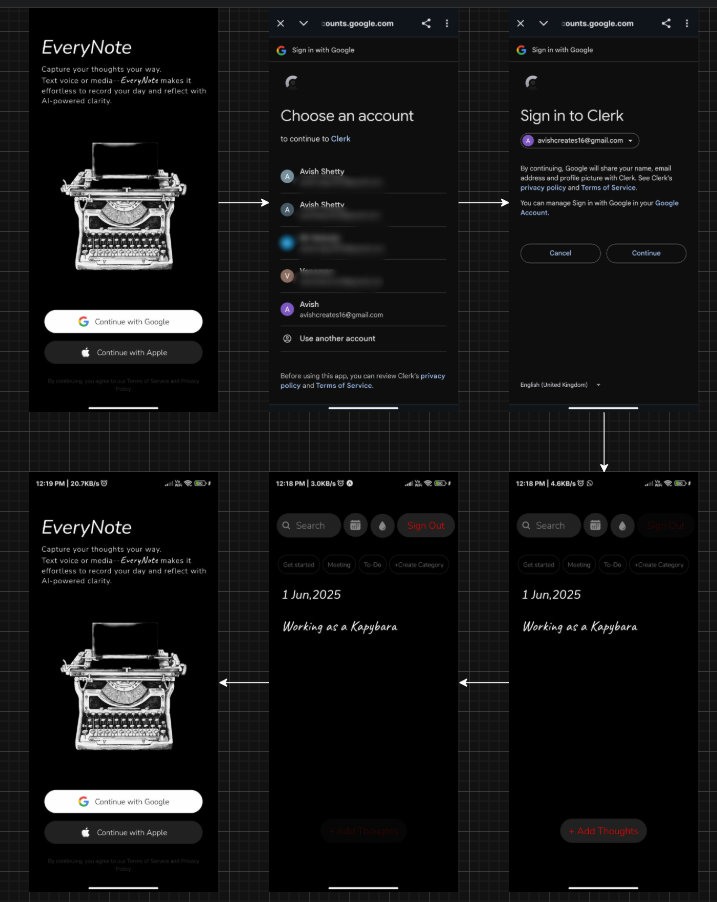

# 📝 EveryNote

Build **EveryNote**, a cross-platform offline-first note-taking app using **Expo** within a **T3 Turborepo**.  
The app features **Google OAuth login**, local offline storage, and a pixel-perfect UI inspired by modern design patterns.  
Data syncing is handled via **PowerSync**, integrating with a **PostgreSQL (Drizzle ORM)** backend through **tRPC** APIs.

---

## ✅ What I Have Achieved

* 🔐 **Google OAuth integrated** using Better-Auth for smooth login  
* 💾 **Local database setup** with `expo-sqlite-3` for offline-first support  
* 🎯 **Pixel-perfect UI** matching the provided designs with high precision  
* 🖼️ **Sign-in & Sign-out flow** fully implemented  
* 🧪 **UI components accurately replicated** — exactly as per the design  
* 🧼 **Clean and responsive layout** across devices  

---

## 🔄 User Flow

Below is the visual flow of the app — from login to note management.

### 🔹 WorkFlow

---

## 🛠️ Tech Stack

- **Frontend**: Expo SDK + React Native + TypeScript  
- **Database**: PostgreSQL (with PowerSync for syncing) + SQLite (offline)  
- **Authentication**: Google OAuth (Better-Auth)  
- **Design**: Custom + react-native-reusables

---

